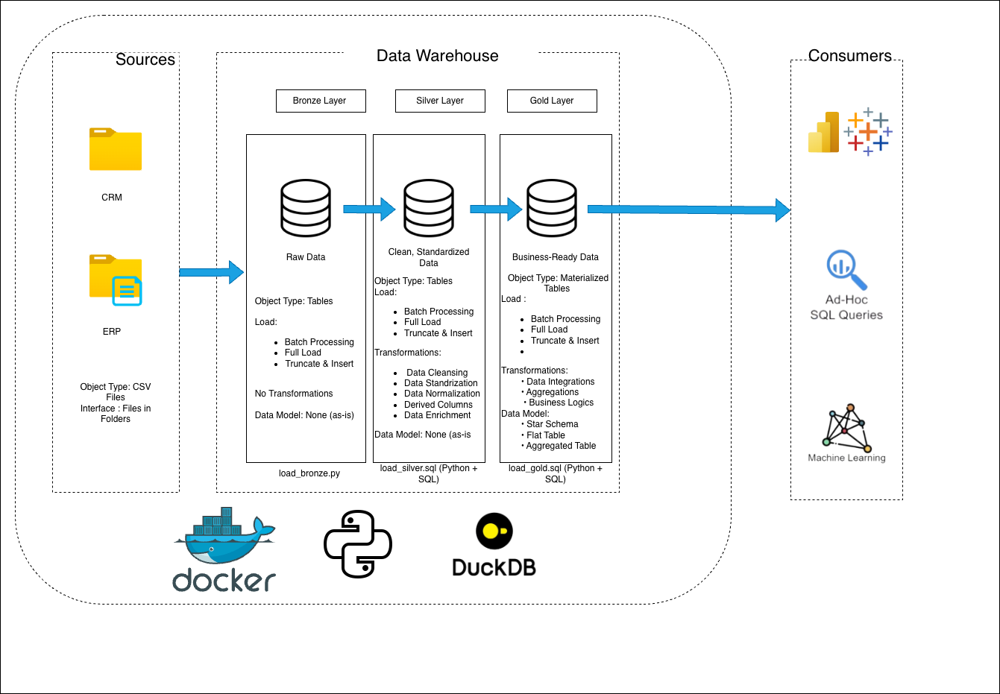
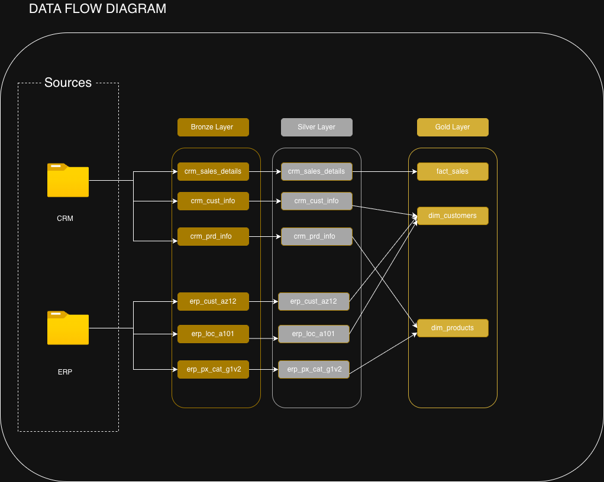
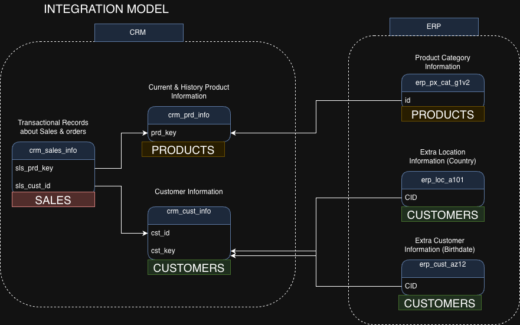

# Modern Data Warehouse With DuckDB, Python and Docker
A modern data warehouse built with **DuckDB, Python, and Docker** using the Medallion Architecture (Bronze → Silver → Gold). Consolidates sales data from two source systems (CRM + ERP) into a star schema optimized for analytical reporting.

> Based on the [Data with Baara SQL Data Warehouse Project](https://www.youtube.com/playlist?list=PLNcg_FV9n7qaUWeyUkPfiVtMbKlrfMqA8), modified to use a cloud-native, serverless stack instead of SQL Server.

---

## Tech Stack

| Tool | Version | Purpose |
|------|---------|---------| 
| **DuckDB** | ≥ 1.4.4 | In-process analytical database (replaces SQL Server) |
| **Python** | ≥ 3.12 | Pipeline orchestration and ingestion scripts |
| **Docker** | — | Containerized, reproducible environment |
| **uv** | — | Fast Python package management |

---

## Architecture



| Layer | Role | Load Strategy |
|-------|------|---------------|
| **Bronze** | Raw ingestion — data as-is from source CSVs | `CREATE OR REPLACE TABLE` (full replace) |
| **Silver** | Cleaned & standardized — nulls, types, dedup, business rules | `DROP + CREATE` then `TRUNCATE + INSERT` (full reload) |
| **Gold** | Star schema — query-ready materialized tables for BI | `DROP + CREATE` (full rebuild) |

### Data Flow



---

## Project Structure

```
sql-data-warehouse/
├── data/
│   └── warehouse.duckdb              # DuckDB database file (auto-created, gitignored)
├── datasets/
│   ├── source_crm/                   # CRM source CSVs
│   │   ├── cust_info.csv
│   │   ├── prd_info.csv
│   │   └── sales_details.csv
│   └── source_erp/                   # ERP source CSVs
│       ├── CUST_AZ12.csv
│       ├── LOC_A101.csv
│       └── PX_CAT_G1V2.csv
├── docs/
│   ├── architecture.png              # Medallion architecture diagram
│   ├── data_model.png                # Gold layer star schema (ER diagram)
│   ├── Integration-model.png         # CRM + ERP source integration model
│   ├── sql-datawarehouse-dataflow.png # End-to-end data flow diagram
│   └── data_catalog.md               # Gold layer data dictionary
├── scripts/
│   ├── bronze/
│   │   └── load_bronze.py            # Ingest CSVs → bronze schema
│   ├── silver/
│   │   └── load_silver.sql           # Clean + standardize → silver schema
│   ├── gold/
│   │   └── load_gold.sql             # Star schema → gold schema
│   ├── init_db.py                    # Create bronze/silver/gold schemas
│   └── run_pipeline.py               # Orchestrate full pipeline end-to-end
├── tests/
│   ├── quality_checks_bronze.sql     # Nulls, duplicates, whitespace, date validity
│   ├── quality_checks_silver.sql     # Referential integrity, standardization
│   └── quality_checks_gold.sql       # Surrogate key uniqueness, FK integrity
├── Dockerfile                        # Container image definition
├── docker-compose.yml                # Service + volume mount config
├── pyproject.toml                    # Python project + dependencies (uv)
└── README.md
```

---

## Data Sources

Two simulated source systems, 6 CSV files total:



| Schema | Table | Rows (approx.) | Description |
|--------|-------|----------------|-------------|
| CRM | `cust_info` | ~18K | Customer profiles — name, gender, marital status |
| CRM | `prd_info` | ~400 | Product catalog — name, cost, line, date ranges |
| CRM | `sales_details` | ~60K | Sales transactions — orders, quantities, prices |
| ERP | `CUST_AZ12` | ~18K | Customer demographics — birthdate, gender |
| ERP | `LOC_A101` | ~18K | Customer location — country |
| ERP | `PX_CAT_G1V2` | ~37 | Product categories and subcategories |

---

## Gold Layer — Star Schema

```
                    ┌──────────────────┐
                    │  dim_customers   │
                    │  customer_key PK │
                    └────────┬─────────┘
                             │ (FK)
┌──────────────────┐         │         ┌──────────────────┐
│   dim_products   │─────────┤         │                  │
│  product_key PK  │  (FK)   └────► fact_sales ◄──────────┘
└──────────────────┘
```

| Table | Columns | Grain | Description |
|-------|---------|-------|-------------|
| `gold.dim_customers` | 10 | One row per customer | CRM + ERP merged, gender master from CRM |
| `gold.dim_products` | 11 | One row per active product | CRM + ERP enriched, historical versions excluded |
| `gold.fact_sales` | 9 | One row per order line | Corrected sales metrics, surrogate FK lookups |


> 📖 Full column-level documentation: [`docs/data_catalog.md`](docs/data_catalog.md)

---

## Documentation

| File | Description |
|------|-------------|
| [`docs/architecture.png`](docs/architecture.png) | Medallion architecture overview (Bronze → Silver → Gold) |
| [`docs/sql-datawarehouse-dataflow.png`](docs/sql-datawarehouse-dataflow.png) | End-to-end data flow from source CSVs through all three layers |
| [`docs/Integration-model.png`](docs/Integration-model.png) | CRM + ERP source system integration model showing how tables are joined |
| [`docs/data_model.png`](docs/data_model.png) | Gold layer star schema ER diagram (dim_customers, dim_products, fact_sales) |
| [`docs/data_catalog.md`](docs/data_catalog.md) | Gold layer data dictionary — entity relationships, column definitions, business rules, and sample queries |

---

## Naming Conventions

| Layer | Pattern | Example |
|-------|---------|---------| 
| Bronze | `<source>_<entity>` | `crm_cust_info`, `erp_loc_a101` |
| Silver | `<source>_<entity>` (cleaned) | `crm_cust_info`, `erp_cust_az12` |
| Gold Dimensions | `dim_<entity>` | `dim_customers`, `dim_products` |
| Gold Facts | `fact_<entity>` | `fact_sales` |
| Surrogate keys | `<entity>_key` | `customer_key`, `product_key` |
| Audit columns | `dwh_<name>` | `dwh_load_date`, `dwh_create_date` |

---

## How to Run

### Option A — Local (uv)

#### Prerequisites

```bash
pip install uv
uv sync
```

#### Full pipeline (one command)

```bash
uv run scripts/run_pipeline.py
```

This runs all three layers in sequence: init → bronze → silver → gold.

#### Step-by-step (manual)

```bash
# Step 1 — Initialize schemas
uv run scripts/init_db.py

# Step 2 — Load bronze layer
uv run scripts/bronze/load_bronze.py

# Step 3 — Load silver layer
duckdb data/warehouse.duckdb < scripts/silver/load_silver.sql

# Step 4 — Load gold layer
duckdb data/warehouse.duckdb < scripts/gold/load_gold.sql
```

#### Run quality checks

```bash
# After bronze load
duckdb data/warehouse.duckdb < tests/quality_checks_bronze.sql

# After silver load
duckdb data/warehouse.duckdb < tests/quality_checks_silver.sql

# After gold load
duckdb data/warehouse.duckdb < tests/quality_checks_gold.sql
```

---

### Option B — Docker

```bash
# Build and run (mounts ./data so the .duckdb file persists on your host)
docker compose up

# Rebuild image after code changes
docker compose up --build
```

The container runs `uv run scripts/run_pipeline.py` and exits after the pipeline completes. The `warehouse.duckdb` file is written to `./data/` on your host via the volume mount.

---

## Pipeline Status

| Layer | Status | Script |
|-------|--------|--------|
| Database Init | ✅ Complete | `scripts/init_db.py` |
| Bronze | ✅ Complete | `scripts/bronze/load_bronze.py` |
| Silver | ✅ Complete | `scripts/silver/load_silver.sql` |
| Gold | ✅ Complete | `scripts/gold/load_gold.sql` |
| Quality Checks | ✅ Complete | `tests/quality_checks_*.sql` |
| Data Catalog | ✅ Complete | `docs/data_catalog.md` |
| Orchestration | ✅ Complete | `scripts/run_pipeline.py` |
| Docker | ✅ Complete | `Dockerfile`, `docker-compose.yml` |

---

## Key Design Decisions

**DuckDB over SQL Server** — File-based, no server setup. Runs in-process with Python. Anyone can clone and run in 60 seconds with zero infrastructure.

**Materialized tables over views** — Gold layer writes data to disk. Downstream BI tools query pre-computed results, not live SQL re-executions. Production-grade pattern.

**Full load (Truncate & Insert)** — All 3 layers use full load. Bronze uses `CREATE OR REPLACE TABLE`; Silver uses `DROP + CREATE` for DDL then `TRUNCATE + INSERT` for data; Gold uses `DROP + CREATE`. Source data is small and historical — no need for incremental merge at this scale.

**Idempotent scripts** — Every script is safe to re-run with no side effects:
- Bronze: `CREATE OR REPLACE TABLE` atomically replaces the table.
- Silver: `DROP TABLE IF EXISTS` + `CREATE` re-establishes the schema, then `TRUNCATE + INSERT` reloads all rows.
- Gold: `DROP TABLE IF EXISTS` + `CREATE TABLE AS SELECT` fully rebuilds each table.

**Surrogate keys are not stable across reloads** — `customer_key` and `product_key` are generated with `ROW_NUMBER()`. They are reassigned on every full rebuild. Always join on surrogate keys within the warehouse; do not persist or cache these integers in external systems.

**CRM as master system for gender** — When CRM and ERP conflict on gender, CRM value is used. ERP is the fallback only when CRM returns `n/a`.

**Audit column on every table** — `dwh_load_date` (bronze) and `dwh_create_date` (silver) track when each record entered the warehouse. Required for debugging and lineage tracing.

**Silver cleans, Gold joins** — Data corrections (dedup, type casting, business rule standardization) happen in Silver. Gold is purely about joining and reshaping for analytical consumption.
